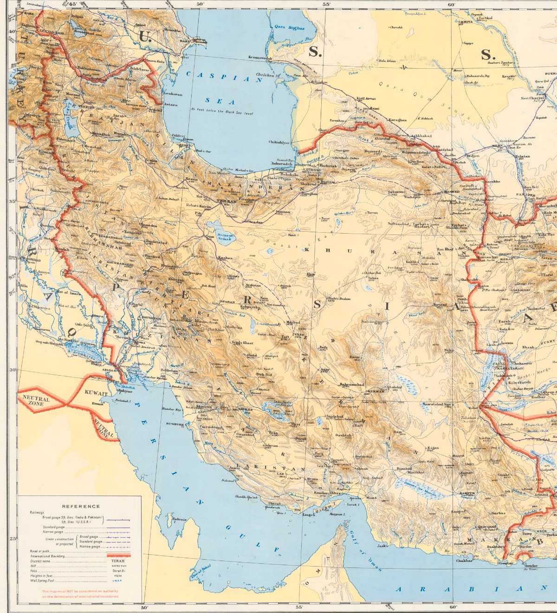
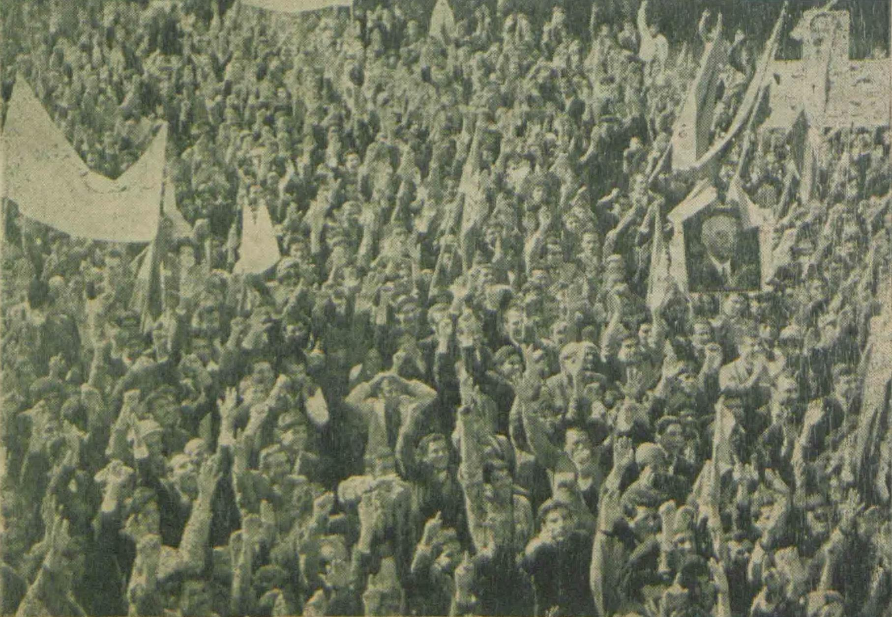
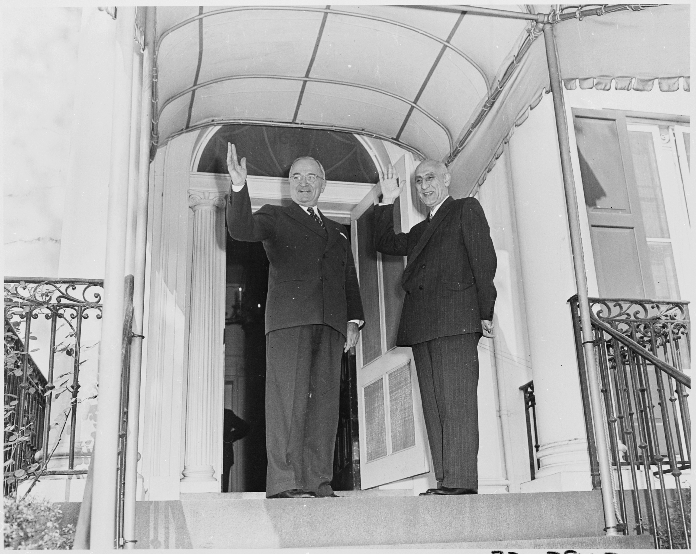
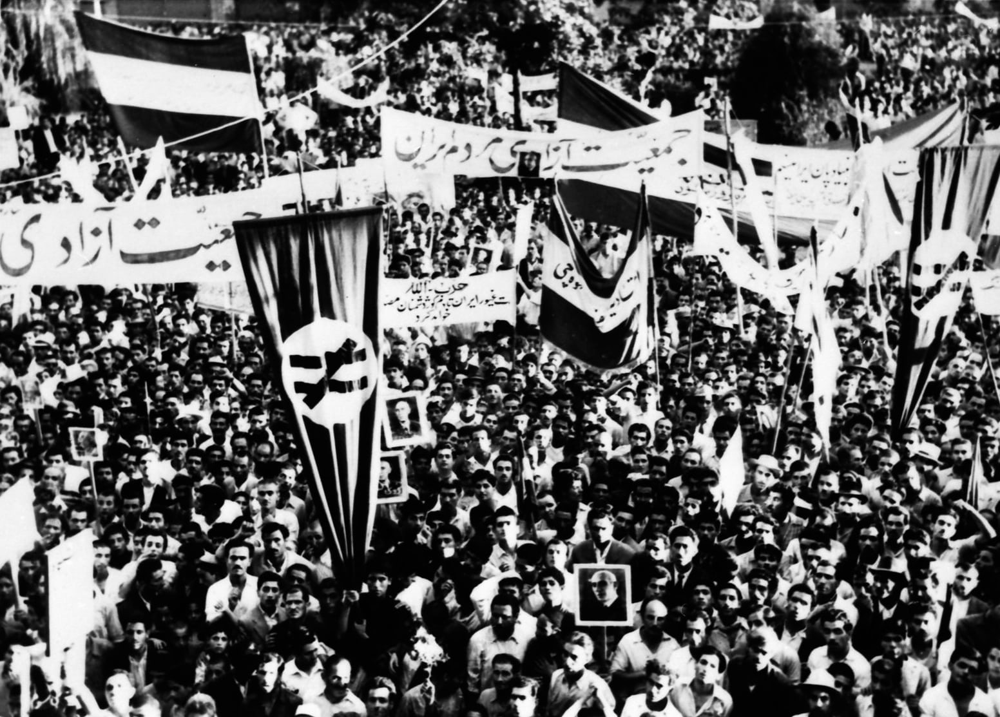
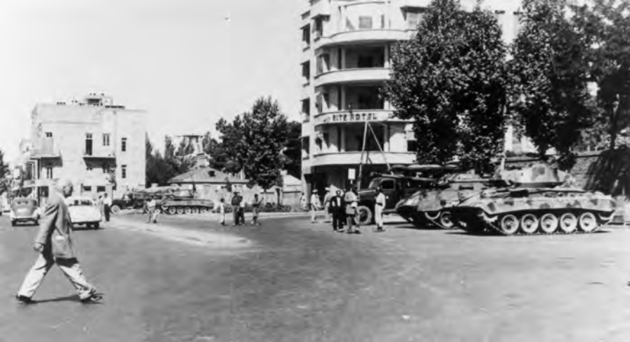

# The Last Majles

## The last opening

On 19 August 1953, tanks and armed units seized Radio Tehran and other central
institutions, and Mohammad Mossadegh's government fell. The coup ended Iran's
last sustained twentieth-century attempt to place elected parliament and
responsible government at the center of national power. The Shah built an
increasingly centralized dictatorship, and the monarchy's fall in 1979
brought an Islamic Republic dominated by Khomeini's movement rather than a
restoration of parliamentary sovereignty. How did an effort with such broad
public authority—capable of nationalizing the oil industry and forcing the
crown into retreat—end in a broken coalition, a dissolved parliament, and a
coup?
([`MAJ-S1`, chapters 1–3 and 15–20](AVAILABLE_SOURCES.md#maj-s1);
[`MAJ-S2`, chapters 7–11](AVAILABLE_SOURCES.md#maj-s2);
[`MAJ-S14`, chapters 6–7 and “History and Contested
Memories”](AVAILABLE_SOURCES.md#maj-s14)).

### Dates and names

Dates are Gregorian. Iranian-calendar dates such as 30 Tir and 9 Esfand are
paired with Gregorian equivalents when first introduced.

Names follow the spellings **Mossadegh**, **Majles**, **Tudeh**, and
**National Front**; published titles retain their original spellings.

## The story in brief

After the Allied invasion ended Reza Shah's dictatorship in 1941, Iran
experienced a turbulent reopening of parliamentary politics. The young
Mohammad Reza Shah, the Majles, political parties, the army, bazaar networks,
organized labor, and politically active clerics competed to determine who
would govern. Britain still controlled Iran's principal industry through the
Anglo-Iranian Oil Company (AIOC). Opposition to both royal power and foreign
domination coalesced around Mossadegh and the National Front.

Parliament nationalized the oil industry in 1951 and made Mossadegh prime
minister. Britain answered with an embargo and an international campaign to
isolate Iran. Mossadegh survived the confrontation and an enormous popular
uprising in July 1952, but his heterogeneous coalition subsequently fractured
while the constitutional struggle with the Shah intensified. Britain and the
United States then organized a coup. Its first attempt failed on 15–16 August
1953; a renewed and partly improvised effort combining covert organization
with Iranian military, political, clerical, press, bazaar, and street networks
overthrew Mossadegh on 19 August.

The returned Shah gradually constructed a much more centralized authoritarian
state. Oil exports returned under a Western consortium. The memory of 1953
poisoned Iran's relationship with the United States and helped shape, without
by itself causing, the opposition that overthrew the monarchy in 1979.

## Iran around 1950

Iran was territorially large, mostly rural, and difficult to govern evenly.
Tehran, the capital, lay in the north beneath the Alborz Mountains. Abadan and
the main oil installations were far to the southwest in Khuzestan, beside the
waterway leading to the Persian Gulf. Iranian Azerbaijan in the northwest and
the Kurdish regions along the western frontier had recently been the scene of
Soviet-backed autonomous movements. Distance, poor communications, and strong
local institutions meant that a decision made in Tehran did not automatically
become power in every province.

Most rural families were tenant sharecroppers, landless laborers, or members
of tribal communities rather than independent proprietors. Landlords, tribal
chiefs, village headmen, and officials often mediated between them and the
state. That made an election formally based on individual male votes
compatible with blocs of dependent voters delivered through local authority.
It also helps explain why the palace, army, governors, and great landowners
could matter more outside major cities than a national party label
([`MAJ-S2`, chapters 1 and 7](AVAILABLE_SOURCES.md#maj-s2)).

Urban political life had its own institutions. The **bazaar** was at once a
market, workshop district, credit system, guild network, and religious center.
Merchants financed mosques, seminaries, charities, and political activity;
clerics preached and maintained followers through many of the same spaces.
These relationships did not make the bazaar or the clergy one political bloc,
but they allowed strikes, donations, messages, and crowds to be organized
without a modern mass party
([`MAJ-S2`, chapter 2, “The Traditional Middle Class”](AVAILABLE_SOURCES.md#maj-s2)).

## The principal actors

- **Mohammad Mossadegh:** an aristocratic constitutionalist, veteran
  parliamentarian, nationalist, and, from 1951, prime minister. His central
  commitments were parliamentary government and effective Iranian control of
  oil. Decades of opposition to autocratic government and foreign concessions
  gave him unusual public authority by the time he led the 1949 palace protest
  that produced the National Front
  ([`MAJ-S2`, chapter 5, especially pp. 250–53](AVAILABLE_SOURCES.md#maj-s2)).
- **Mohammad Reza Shah:** the young monarch who succeeded his father in 1941.
  Initially weak, he sought to preserve his personal relationship with the
  armed forces and recover the crown's political authority.
- **The National Front:** a coalition rather than a disciplined party. It
  included veteran constitutional politicians, the secular Iran Party,
  journalists such as Hossein Fatemi, bazaar-connected politicians, and,
  initially, Ayatollah Abol-Qasem Kashani and his supporters. Its breadth
  enabled mass mobilization but made coherent government difficult
  ([`MAJ-S2`, chapter 5](AVAILABLE_SOURCES.md#maj-s2);
  [`MAJ-S14`, chapter 1, “Mosaddeq and the National
  Front”](AVAILABLE_SOURCES.md#maj-s14)).
- **The Tudeh Party:** Iran's large communist party, with important labor,
  student, intellectual, and clandestine military networks. It initially
  denounced Mossadegh as insufficiently anti-imperialist and later supported
  him tactically without entering his coalition.
- **Ayatollah Abol-Qasem Kashani:** a politically active cleric and important
  mobilizer against British influence. He supported nationalization and
  Mossadegh before becoming one of the prime minister's major opponents. He
  did not speak for the clergy as a whole: senior clerics and local religious
  networks differed over both daily political intervention and Mossadegh
  ([`MAJ-S2`, chapters 5–6](AVAILABLE_SOURCES.md#maj-s2);
  [`MAJ-S14`, chapters 1 and 5](AVAILABLE_SOURCES.md#maj-s14)).
- **The court and armed forces:** not one unified faction, but the Shah's most
  important institutional base. Mossadegh never made the officer corps
  reliably answerable to his cabinet.
- **Ahmad Qavam:** a veteran, independent statesman who had previously
  resolved the 1946 Iranian Azerbaijan crisis. The Shah turned to him when
  Mossadegh resigned in July 1952; his brief premiership ended in the 30 Tir
  uprising of 21 July 1952.
- **General Fazlollah Zahedi:** a former minister and senator with military,
  court, and foreign connections. By 1953 he had become the alternative prime
  minister around whom the coup coalition was organized.
- **Britain and the AIOC:** Britain regarded the company as a strategic,
  financial, and imperial asset. It was prepared to adjust Iran's revenue but
  resisted nationalization when that meant losing operational control.
- **The United States:** initially attempted mediation while also supporting
  economic and covert pressure. Under the Eisenhower administration, it
  joined Britain in deciding that Mossadegh should be removed.

## Political map: how power worked

### The constitutional framework

Iran's constitutional order rested on the Fundamental Law of 1906 and its
1907 Supplement. They created a constitutional monarchy and a 136-seat elected
Majles with two-year terms and authority over legislation, budgets, borrowing,
concessions, treaties, ministerial confidence, and deputies' credentials. The
same texts called the Shah chief executive and commander of the armed forces
while making ministers responsible to parliament. The resulting ambiguity—an
inviolable monarch with executive powers beside a responsible cabinet—was the
central constitutional problem
([`MAJ-S3`, chapter 3, pp. 79–86](AVAILABLE_SOURCES.md#maj-s3);
[`MAJ-S1`, chapters 1–3](AVAILABLE_SOURCES.md#maj-s1)).

### How a government was formed

Voters did not directly elect a prime minister. Parliamentary factions first
assembled behind a candidate through a **vote of inclination** (*ezhar-e
tamayol*). The Shah then issued a *firman*, or royal decree, authorizing that
person to form a government; the ministry returned to the Majles for a **vote
of confidence** (*ray-e e'temad*). The chamber could later withdraw confidence,
and a new Majles expected an incumbent ministry to seek a fresh inclination.
The crisis repeatedly tested whether the Shah had to follow these conventions
or could use the royal decree as an independent power
([`MAJ-S3`, pp. 79–86 and 96–103](AVAILABLE_SOURCES.md#maj-s3)).

### The Shah, the army, and the 1949 revision

The Shah treated command of the armed forces as a personal prerogative;
constitutionalists argued that the army had to obey the responsible cabinet.
The War Ministry controlled commands, promotions, transfers, and military
spending, while the Interior Ministry controlled governors, police, and much
of the election machinery. Palace influence over those ministries therefore
meant leverage over both coercion and the production of parliamentary power
([`MAJ-S1`, chapter 19, especially pp. 288–92](AVAILABLE_SOURCES.md#maj-s1);
[`MAJ-S3`, chapter 3](AVAILABLE_SOURCES.md#maj-s3)).

A constituent assembly convened after the 1949 attempt on the Shah's life gave
him a new power to dissolve either chamber, with elections required within
three months. It did not settle whether he could dismiss a prime minister who
still claimed parliamentary or popular support—the question at the center of
August 1953
([`MAJ-S1`, chapters 15–20](AVAILABLE_SOURCES.md#maj-s1);
[`MAJ-S3`, pp. 82–86](AVAILABLE_SOURCES.md#maj-s3)).

### The Senate

The constitutional texts had provided for a sixty-member Senate, but it did
not actually convene until February 1950. Thirty senators were appointed by
the Shah and thirty were chosen indirectly. Its eligibility rules, six-year
term, and royal half made it a conservative check on the Majles, though not a
disciplined royalist party: appointment route did not determine every vote
([`SUP-053`](AVAILABLE_SOURCES.md#sup-053);
[`MAJ-S2`, pp. 260–67](AVAILABLE_SOURCES.md#maj-s2)).

Government formation remained centered on the Majles, but the new Senate also
began taking inclination votes without establishing an agreed second veto. In
July 1952 Mossadegh won decisively in the Majles but received only fourteen of
forty-five Senate votes; days later the Shah appointed Qavam without awaiting
a Senate vote. After 30 Tir, the Majles shortened the Senate's term from six
years to two, causing the First Senate to expire
([`MAJ-S3`, pp. 82–86 and 96–103](AVAILABLE_SOURCES.md#maj-s3)).

### How Majles elections worked

Adult men voted for named candidates in territorial constituencies, some of
which returned several deputies; Tehran returned twelve. Women remained
excluded despite an organized suffrage campaign and Mossadegh's support for
reconsideration. Polling proceeded constituency by constituency over weeks or
months rather than on one national election day. Candidates entered as
individual deputies, could change caucuses, and had to survive a Majles vote
on their credentials before taking their seats
([`SUP-015`, pp. 270–79](AVAILABLE_SOURCES.md#sup-015);
[`MAJ-S3`, pp. 86–100](AVAILABLE_SOURCES.md#maj-s3)).

The Interior Ministry, governors, local boards, landlords, tribal leaders, and
military authorities could all shape voting and certification. Mossadegh
stopped the unfinished elections for the Seventeenth Majles once enough
deputies had been returned to convene, arguing that continued polling would
manufacture a palace-backed majority. The chamber functioned with 79 accepted
credentials, but attendance later fell much lower. Because two-thirds of the
operative membership was needed to debate and three-quarters to vote, absences
and walkouts could disable parliament as effectively as defeating a motion
([`SUP-052`](AVAILABLE_SOURCES.md#sup-052);
[`MAJ-S3`, pp. 92–100 and 112–17](AVAILABLE_SOURCES.md#maj-s3)).

### Parliamentary balance

The Sixteenth Majles was predominantly conservative, with only eight firm
National Front deputies; oil nevertheless enabled that small group to assemble
a much wider nationalization coalition. The Seventeenth began with roughly
thirty deputies inside or close to the Front and a larger but divided field of
opponents and conditional notables. As allies defected in 1953, attendance and
quorum mattered more than any fixed party count
([`SUP-007`, sessions 128 and 141](AVAILABLE_SOURCES.md#sup-007);
[`MAJ-S2`, pp. 250–67 and 269–70](AVAILABLE_SOURCES.md#maj-s2);
[*Foreign Relations of the United States*, docs. 67, 192, 233, and
239](BIBLIOGRAPHY.md#p1)).

### Parties, factions, and political networks

Iran did not have a stable national party system. Formal parties and slates
mattered, especially in Tehran, but deputies also followed local notables,
families, patrons, landlords, tribal leaders, officials, and temporary
parliamentary caucuses.

Political power also operated outside parliament:

- **The bazaar** meant more than a marketplace. Merchants, craft guilds,
  lenders, mosques, and neighborhood connections could finance politics,
  close commerce, circulate messages, and bring crowds into the streets.
- **The ulama**, or Shi'i religious scholars, did not form a single hierarchy.
  Individual clerics possessed different religious followings, bazaar
  connections, and political ambitions.
- **The press** was highly partisan. A newspaper could be an organization,
  patronage network, and mobilizing instrument as much as a business.
- **The armed forces** were the Shah's most dependable institutional base, but
  officers also formed competing personal and conspiratorial networks.
- **The street** was not one actor. Students, party militants, guild members,
  religious followers, workers, neighborhood strongmen, police, and soldiers
  could appear together without sharing the same purpose.

## Economic map: why oil dominated the crisis

### An unequal oil enclave

Most Iranians worked outside petroleum, but oil supplied crucial state revenue
and foreign exchange. The British-controlled AIOC ran production, the Abadan
refinery, shipping, sales, and much of the accounting by which Iran's payments
were calculated. Around Abadan it also provided housing, utilities, clinics,
schools, and subsidized goods through a sharply unequal company hierarchy.
Nationalization therefore concerned sovereignty, labor, development, and
control of an industrial welfare system—not only the royalty rate
([`MAJ-S9`, chapters 3–4](AVAILABLE_SOURCES.md#maj-s9);
[`MAJ-S14`, chapter 1](AVAILABLE_SOURCES.md#maj-s14);
[`SUP-055`, pp. 31–38](AVAILABLE_SOURCES.md#sup-055)).

### What nationalization had to accomplish

Nationalization transferred legal ownership to Iran, but ownership alone could
not sell oil. Exports required tankers, insurance, buyers, finance, marketing,
and protection against lawsuits and British retaliation. Iranian personnel
could operate much of the physical industry; replacing the AIOC's international
commercial system was harder. A “fifty-fifty” division of profits also left
management, auditing, output, marketing, and compensation unsettled, so
apparently generous offers could still fail the sovereignty test
([`MAJ-S3`, chapters 1–2](AVAILABLE_SOURCES.md#maj-s3);
[`MAJ-S12`, nationalization and negotiation
chapters](AVAILABLE_SOURCES.md#maj-s12)).

### Adjustment without oil exports

When the embargo reduced oil exports almost to zero, imports and development
spending fell, credit expanded, and oil-dependent workers and towns suffered.
Currency depreciation, non-oil exports, import compression, taxes, reserves,
and domestic credit nevertheless kept the state operating through August
1953. Iran was neither economically unharmed nor demonstrably hours from
bankruptcy, and national totals reveal little about how unevenly households
experienced the shock
([`SUP-023`, pp. 2–18](AVAILABLE_SOURCES.md#sup-023)).

### “Oil-less economics” was a program

After 30 Tir, Mossadegh's government directed credit toward agriculture,
import substitution, and non-oil exports. Exchange certificates made imports
dearer, encouraged exports, and rationed scarce foreign currency. The US Point
Four rural technical-assistance program supported irrigation, seeds, health,
and anti-malaria work even as Washington moved toward regime change. These
measures did not make settlement unnecessary or prove that survival without
oil was indefinitely sustainable, but they constituted an economic program
rather than passive endurance
([`MAJ-S18`, pp. 120–28](AVAILABLE_SOURCES.md#maj-s18);
[`SUP-057`, pp. 187–88](AVAILABLE_SOURCES.md#sup-057)).

## 1. Before Mossadegh: concession, dictatorship, and political opening

### 1901–1941: oil and the Pahlavi state

A British concession granted in 1901 led to the discovery of oil in 1908 and
the creation of the Anglo-Persian Oil Company, later the AIOC. The British
government acquired a controlling interest, and Iranian oil became
strategically important to the Royal Navy.

Reza Shah's government renegotiated the concession in 1933 under profoundly
unequal political conditions. The agreement improved some financial terms but
extended the concession until 1993. Iranian nationalists subsequently treated
it as an illegitimate surrender of national resources.

Meanwhile, Reza Shah dismantled meaningful parliamentary government.
Elections were controlled, ministers answered to the ruler, and the army
became the foundation of royal power
([`MAJ-S14`, chapter 1, pp. 10–15](AVAILABLE_SOURCES.md#maj-s14);
[`MAJ-S2`, chapter 3, pp. 135–65](AVAILABLE_SOURCES.md#maj-s2)).

### 1941: the dictatorship abruptly opens

Britain and the Soviet Union invaded Iran in August 1941, principally to
secure the wartime supply route and forestall German influence. Reza Shah was
forced to abdicate in favor of his twenty-one-year-old son.

The occupation was humiliating, but Reza Shah's removal reopened political
life. The press and parties proliferated, the Majles recovered some
independence, labor organization expanded, and the Tudeh Party became a mass
political force. The young Shah began a long struggle to recover the powers
exercised by his father
([`MAJ-S2`, pp. 164–76](AVAILABLE_SOURCES.md#maj-s2)).

Iran now had an unresolved constitutional problem. The written 1906–07 order
made ministers responsible to the Majles and described the monarch as
politically inviolable and therefore not responsible for government. The
precedents established under Reza Shah instead gave the monarch personal
control over elections, ministers, and the armed forces. That contradiction
underlies nearly everything that follows
([`MAJ-S3`, chapter 3, “The Constitution”](AVAILABLE_SOURCES.md#maj-s3);
[`MAJ-S1`, chapters 1–3](AVAILABLE_SOURCES.md#maj-s1)).

### 1946–1949: pressure mounts

A major oil-workers' strike at Abadan in 1946 exposed poor working and living
conditions as well as the political power of organized labor
([`MAJ-S9`, chapters 3–4](AVAILABLE_SOURCES.md#maj-s9)). Soviet forces delayed
their promised withdrawal while supporting an autonomous government in
Iranian Azerbaijan and the Kurdish Republic of Mahabad. The central state
restored control after the Soviet withdrawal and the collapse of both
movements. The episode made anti-communism, separatism, and territorial
integrity central political concerns
([`MAJ-S2`, chapter 5](AVAILABLE_SOURCES.md#maj-s2);
[`MAJ-S20`, chapter 4, pp. 89–125](AVAILABLE_SOURCES.md#maj-s20);
[`MAJ-S21`, pp. 123–216](AVAILABLE_SOURCES.md#maj-s21)).

On 4 February 1949, an assassin fired at the Shah. The government used the
attempt to impose martial law, suppress the Tudeh Party, arrest opponents, and
convene a constituent assembly. The Shah acquired a power to dissolve the
Majles and appointed half of the newly convened Senate. The monarchy was
rebuilding its position just as the oil question became politically
explosive
([`MAJ-S3`, chapter 3, “The Constitution”](AVAILABLE_SOURCES.md#maj-s3);
[`MAJ-S1`, chapter 15](AVAILABLE_SOURCES.md#maj-s1)).

## 2. The National Front and nationalization, 1949–1951

### October–November 1949: the National Front emerges

Government manipulation of the Sixteenth Majles election produced a protest
led by Mossadegh. Opposition politicians sought sanctuary at the royal palace
and demanded honest elections, freedom of the press, and an end to martial
law. This was a form of *bast*: protestors placed themselves under the
protection of a sacred or politically difficult-to-violate site. Their
cooperation became the National Front.

Oil was not the coalition's only, or initially even its principal, demand. It
soon joined two questions that became inseparable: Iranian sovereignty over
the country's most important natural resource and constitutional government
free of royal and foreign interference. Sources place the palace protest on
differing dates in October 1949
([`MAJ-S1`, pp. 207–08](AVAILABLE_SOURCES.md#maj-s1);
[`MAJ-S2`, chapter 5](AVAILABLE_SOURCES.md#maj-s2)).

The protest did not itself deliver a parliamentary majority. Disputed voting
in Tehran was cancelled and rerun; Mossadegh and seven allies then entered the
predominantly conservative Sixteenth Majles. In May 1950, the government
created an eighteen-member oil committee that included five National Front
deputies and made Mossadegh its chair. The committee gave this small,
organized delegation a platform from which procedural work, public pressure,
and the unifying oil question could attract deputies who did not belong to the
Front. The committee allowed the small National Front delegation to turn
procedural work, public pressure, and the oil question into a much broader
parliamentary coalition for nationalization
([`MAJ-S2`, chapter 5, especially pp. 250–67](AVAILABLE_SOURCES.md#maj-s2);
[`MAJ-S14`, chapter 1](AVAILABLE_SOURCES.md#maj-s14)).

### 1949–1950: the supplemental agreement fails

The AIOC and Iran negotiated the Gass–Golshayan Supplemental Agreement. It
offered more revenue but left the company's structure and control
substantially intact. International conditions made the offer increasingly
indefensible: in 1950 Saudi Arabia obtained a nominal fifty-fifty profit
arrangement from Aramco, encouraging Iranians to ask why their older industry
should accept less.

Prime Minister Haj Ali Razmara argued that immediate nationalization was
administratively and economically dangerous. The AIOC's refusal to offer
substantially better terms weakened him. The Majles oil committee rejected the
supplemental agreement on 25 November 1950, and the Majles rejected it on
11 January 1951
([`MAJ-S14`, chapter 1, “The Oil Dispute, 1949–1950”](AVAILABLE_SOURCES.md#maj-s14);
[`MAJ-S3`, chapter 1, “Oil Nationalization”](AVAILABLE_SOURCES.md#maj-s3)).

### March 1951: assassination and nationalization

On 7 March 1951, Khalil Tahmasabi, a member of the militant Islamist
Fada'iyan-e Islam, assassinated Razmara. Who else encouraged or knew about the
assassination remains unknown. The oil committee approved
nationalization the following day. The Majles approved the principle in
mid-March, and the Senate approved it on 20 March
([`MAJ-S14`, chapter 1, pp. 36–38](AVAILABLE_SOURCES.md#maj-s14)).

The legislation did not merely demand better royalties. It nationalized the
industry throughout Iran. A subsequent nine-article law set out how
nationalization would be implemented
([`SUP-006`, printed pp. 15–16](AVAILABLE_SOURCES.md#sup-006)).

### April–May 1951: Mossadegh becomes prime minister

The Majles gave Mossadegh a vote of inclination in late April. The Shah then
issued the firman authorizing him to form a government, and the new ministry
returned for parliamentary confidence. Mossadegh had accepted on the condition
that the implementation law be enacted. The National Iranian Oil Company
became the legal vehicle for taking control.

This was the high point of a remarkably broad national consensus. Iranian
engineers could operate much of the industry, but the confrontation exposed
acute weaknesses in tanker access, international marketing, some specialized
refining processes, and protection against a coordinated boycott
([`MAJ-S1`, chapters 16–17](AVAILABLE_SOURCES.md#maj-s1);
[`MAJ-S14`, chapter 1](AVAILABLE_SOURCES.md#maj-s14)).

## 3. The first Mossadegh government and the oil confrontation

### Britain's counterattack

Britain refused to accept nationalization as Iran defined it. British
technicians withdrew from Abadan; the last group left in October 1951.
Britain:

- excluded Iranian oil from its established markets;
- threatened legal action against purchasers and tanker operators;
- restricted Iran's access to sterling assets;
- sought international condemnation;
- prepared military options, although it did not invade; and
- sought an Iranian government prepared to settle on different terms.

The resulting embargo reduced Iran from a major oil exporter to a negligible
one
([`MAJ-S14`, chapters 2–3](AVAILABLE_SOURCES.md#maj-s14);
[`MAJ-S12`, “Nationalization” and “Negotiations” chapters](AVAILABLE_SOURCES.md#maj-s12)).

### Why negotiations failed

The proposals changed, but the underlying dispute repeatedly returned. In
July 1951, President Truman sent Averell Harriman to reopen talks and restrain
British pressure. Harriman induced Britain to negotiate on the “principle of
nationalization.” Richard Stokes then proposed that Iran formally receive the
AIOC's assets while an AIOC operating company still ran production and
refining and an AIOC-linked organization bought the oil. Iran countered that
the National Iranian Oil Company should employ foreign technicians itself and
sell oil through ordinary contracts. Mossadegh accepted a purchasing
organization but not British control of its staff; Stokes would not accept
British personnel working for NIOC, and his mission ended in August
([`MAJ-S14`, chapter 2, “Harriman Comes to Iran” and “The Stokes
Proposal”](AVAILABLE_SOURCES.md#maj-s14)).

During Mossadegh's October–November visit to Washington, Assistant Secretary
of State George McGhee tried a new division between ownership and operation.
NIOC would own the fields, but a mostly foreign board and a nominally neutral
company—expected to be Royal Dutch Shell—would manage them; AIOC would market
most output and another foreign company would run Abadan. Price now became
decisive. Mossadegh sought roughly the producing-company price—the price at
which the producer sold the oil before its costs and profits were
divided—while McGhee offered the lower tax-and-royalty-style return received
by host governments elsewhere. Britain rejected even that plan because it displaced
AIOC, restricted compensation, and threatened British interests in other oil
concessions
([`MAJ-S14`, chapter 3, “The Charm Offensive” and “The Price of a
Deal”](AVAILABLE_SOURCES.md#maj-s14)).

The World Bank's January–March 1952 intervention was meant to postpone those
final questions. For as long as two years, the Bank would manage the industry,
finance its restart, sell oil to AIOC, and hold part of the proceeds in escrow
without deciding the ultimate legal claims. That bridge foundered over the
return of British technicians, whether the Bank would act “for Iran's
account”—meaning that it would manage on behalf of Iranian ownership rather
than as an independent concession holder—Iran's control of personnel and
direct sales, and the discounted price. Talks adjourned on 17 March; the Bank
publicly announced the recess on 3 April
([`SUP-026`, Press Release No. 285 and attached review, PDF pp.
3–9](AVAILABLE_SOURCES.md#sup-026);
[`MAJ-S14`, chapter 3, “The World Bank Intervention” and “The End of the
World Bank's Efforts”](AVAILABLE_SOURCES.md#maj-s14)).

The dispute was therefore not simply over a royalty percentage. Iran would
discuss compensation but would not accept arrangements that restored foreign
control in substance or valued the cancelled concession as decades of lost
future profits. Britain sought continued access to experienced foreign
management, protection for AIOC, and terms that would not encourage
nationalization elsewhere. Through 1952, Washington increasingly tied aid to
a settlement and feared that prolonged deadlock would strengthen the Tudeh,
but the Truman administration still refused Britain's request for support for
a coup. There was real room for negotiation, but no politically easy bargain.
Interim arrangements could restart the industry only by postponing conflicts
over control, personnel, sales, and compensation—the very questions on which
both sides believed their larger political position depended
([`MAJ-S3`, pp. 56–58](AVAILABLE_SOURCES.md#maj-s3);
[`MAJ-S6`, revised preface and chapters 8–9](AVAILABLE_SOURCES.md#maj-s6);
[`MAJ-S12`, negotiation chapters](AVAILABLE_SOURCES.md#maj-s12);
[`MAJ-S14`, chapters 3–5](AVAILABLE_SOURCES.md#maj-s14)).

## 4. The constitutional showdown and the July uprising

### The Seventeenth Majles

Elections for the Seventeenth Majles were heavily contested. Mossadegh halted
voting before every seat had been filled, arguing that royal and military
interference made honest elections impossible. Opponents regarded the
decision as manipulation. The resulting parliament contained National Front
supporters but also formidable opposition, and procedural conflict became a
principal arena of the crisis
([`MAJ-S3`, chapter 3, “The Seventeenth Majles”](AVAILABLE_SOURCES.md#maj-s3);
[`MAJ-S1`, chapter 18](AVAILABLE_SOURCES.md#maj-s1)).

### 16–21 July 1952: who controls the army?

Mossadegh demanded direct control of the War Ministry. The Shah refused.
Because senior command remained tied to the palace, this was not a symbolic
cabinet appointment: it decided whether the government controlled the
coercive state.

Mossadegh resigned on 16 July. On 17 July, with government supporters
boycotting the sitting, 40 of the 43 Majles deputies present backed Ahmad
Qavam. The Shah then issued Qavam's firman without awaiting Senate approval.
Qavam announced that he would restore order and resolve the crisis. On
21 July—30 Tir in the Iranian calendar—a general uprising engulfed Tehran and
other cities. National Front organizations, bazaar networks, Kashani's
followers, and the Tudeh mobilized, but not under one command. Security forces
fired on demonstrators. An estimated 250 or more demonstrators were killed or
seriously injured across Tehran, Hamadan, Ahvaz, Isfahan, and Kermanshah. The
figure combines deaths and serious injuries across five cities; no agreed
death toll survives
([`MAJ-S2`, p. 271](AVAILABLE_SOURCES.md#maj-s2)).

The Shah retreated, Qavam resigned, and Mossadegh returned in triumph.
Prominent party and clerical leaders mattered, but commercial, neighborhood,
and crowd networks were equally crucial to the mobilization
([`MAJ-S1`, chapter 19, pp. 288–92](AVAILABLE_SOURCES.md#maj-s1);
[`SUP-014`, pp. 159–75](AVAILABLE_SOURCES.md#sup-014)).

### 22 July 1952: the ICJ ruling

The day after 30 Tir, the International Court of Justice ruled that it lacked
jurisdiction over Britain's case. This was an important legal victory for
Iran, but it neither restored oil exports nor broke the embargo
([`SUP-017`, judgment](AVAILABLE_SOURCES.md#sup-017)).

### Mossadegh at the height of his power

After 30 Tir, Mossadegh acquired the War Ministry, renamed the Ministry of
National Defense, and received six months of emergency legislative powers,
later extended for one year.

Parliament temporarily delegated defined lawmaking fields to the cabinet.
Mossadegh could put decrees into effect without a prior chamber vote, but they
were provisional and ultimately had to return to the Majles for endorsement.
Supporters presented this as temporary capacity for reform during an
emergency. Opponents and some former allies saw the extension as rule around
the legislature. The grant was therefore at once a victory over royal
interference, an effort to govern amid parliamentary obstruction, a
concentration of authority in the prime minister, and a cause of the
coalition's breakup
([`MAJ-S3`, chapter 3](AVAILABLE_SOURCES.md#maj-s3)).

## 5. The coalition fractures, 1952–1953

30 Tir restored Mossadegh at the head of a coalition that had won the
same battle for different reasons. His cabinet, weighted toward loyal Iran
Party and technocratic figures, and his efforts to curtail court influence
exposed tensions that already existed. Former lieutenants soon disputed
appointments and access: Mozaffar Baghai and Hossein Makki believed newer
figures had received offices that they had earned, while Ayatollah Abol-Qasem
Kashani challenged appointments and government intrusions into clerical,
bazaar, and patronage networks
([`MAJ-S2`, pp. 271–76](AVAILABLE_SOURCES.md#maj-s2);
[`MAJ-S3`, pp. 103–06](AVAILABLE_SOURCES.md#maj-s3);
[`MAJ-S6`, pp. 164–67](AVAILABLE_SOURCES.md#maj-s6)).

By autumn, Baghai had ceased meeting Mossadegh, made contact with Zahedi and
other opponents, and split the Toilers' Party. Despite its socialist name,
the party had joined unlike constituencies: Baghai's nationalist-populist
organization drew on traditional bazaar and street networks, while Khalil
Maleki led a Marxist intellectual wing. Maleki and most activists reorganized
as the Third Force and remained pro-Mossadegh. Real policy conflicts sharpened
the personal contest. Government regulation, land and labor measures,
electoral reform and possible women's suffrage, martial law, fear of Tudeh
influence, and delegated legislation all threatened some former allies'
principles, constituents, or power
([`MAJ-S2`, pp. 275–78](AVAILABLE_SOURCES.md#maj-s2);
[`MAJ-S3`, pp. 103–11](AVAILABLE_SOURCES.md#maj-s3);
[`MAJ-S6`, pp. 167–71](AVAILABLE_SOURCES.md#maj-s6)).

The embargo narrowed the room in which these disputes could be compromised.
Oil revenue vanished without producing an immediate nationwide price
collapse, but import compression, unpaid contractors and bonuses, urban
unemployment, and development retrenchment accumulated; retaining former oil
workers shifted part of the shock onto the budget. The government's
answers—new taxes, credit expansion, regulation, and provisional reforms—gave
opponents concrete arguments about inflation, property, and executive power.
The burden varied substantially by place and class, and each defection also
reflected political interests, personal rivalry, or disagreement over the
government's direction
([`MAJ-S18`, pp. 120–44](AVAILABLE_SOURCES.md#maj-s18);
[`SUP-023`, pp. 2–18](AVAILABLE_SOURCES.md#sup-023)).

The Tudeh increasingly defended Mossadegh against royalism and imperialism,
but remained institutionally separate and distrusted him. Its visible street
power frightened conservatives, clerics, landowners, officers, and American
policymakers. It was a major political force, but it neither controlled the
government nor had the position within the armed forces required for an
immediate seizure of power in August 1953
([`MAJ-S2`, chapter 6](AVAILABLE_SOURCES.md#maj-s2);
[`MAJ-S4`, Maziar Behrooz, pp. 102–25](AVAILABLE_SOURCES.md#maj-s4)).

The coalition broke apart for several reasons at once: widening social and
ideological differences, rivalry over appointments and access, disputes over
Mossadegh's authority, and tactical frustration. It had united people whose
desired futures for Iran were fundamentally incompatible
([`MAJ-S1`, chapter 20](AVAILABLE_SOURCES.md#maj-s1);
[`MAJ-S2`, pp. 275–78](AVAILABLE_SOURCES.md#maj-s2);
[`MAJ-S6`, chapters 11–12](AVAILABLE_SOURCES.md#maj-s6)).

### October 1952: relations with Britain are broken

After continuing British political activity and failed negotiations, Iran
severed diplomatic relations with Britain. British intelligence officers
left. The closure badly impaired Britain's ability to direct its assets, but
networks including the Rashidian brothers and contacts in political, military,
clerical, and bazaar circles survived. Their later operational use depended
substantially on liaison through the CIA
([`MAJ-S14`, chapter 6, “Approaching the Shah”](AVAILABLE_SOURCES.md#maj-s14)).

### January 1953: emergency powers and open rupture

The coalition's rupture became public when Kashani, Baghai, Makki, and allied
deputies opposed extending Mossadegh's delegated lawmaking powers for another
year. The deputies abstained when the issue was tied to
confidence, which Mossadegh still won by 59 votes to 1. The result showed both
that the former allies had openly broken and that their dissent had not yet
become a parliamentary majority
([`MAJ-S3`, pp. 103 and 108–09](AVAILABLE_SOURCES.md#maj-s3);
[`MAJ-S6`, pp. 170–71](AVAILABLE_SOURCES.md#maj-s6)).

### 28 February 1953: the 9 Esfand crisis

The immediate dispute concerned the boundary between crown and government.
Mossadegh demanded an end to palace and army intrigues, transfer of control
over the royal estates, and the Shah's subordination to the responsible
government. The Shah then offered to leave Iran temporarily. Whether he
genuinely intended to go—and whether Mossadegh merely accepted or actively
encouraged the plan—is unclear. Opponents presented it as an attempt to drive
out the monarch
([`MAJ-S5`, pp. 49–59](AVAILABLE_SOURCES.md#maj-s5);
[`MAJ-S14`, chapter 5, “9 Esfand”](AVAILABLE_SOURCES.md#maj-s14)).

Royalist officers, politically active clerics, and crowds mobilized to prevent
the Shah's departure. A crowd attacked Mossadegh's residence, and the prime
minister escaped through the rear of the compound.

The incident demonstrated how anti-government crowds, officers, court
politicians, and clerical networks could cooperate. It also showed the
mobilizing power of presenting the Shah's departure as imminent, making
9 Esfand an important precursor to August
([`MAJ-S5`, pp. 49–59](AVAILABLE_SOURCES.md#maj-s5);
[`MAJ-S14`, chapter 5, “9 Esfand”](AVAILABLE_SOURCES.md#maj-s14)).

### April 1953: Afshartus is murdered

General Mahmoud Afshartus, Mossadegh's police chief and an important loyal
security official, was kidnapped and murdered. His removal deprived the
government of a trusted commander amid several overlapping conspiracies. No
documented link shows that foreign governments directed the murder
([`MAJ-S5`, chapter 4](AVAILABLE_SOURCES.md#maj-s5);
[`MAJ-S14`, pp. 138–39 and 155](AVAILABLE_SOURCES.md#maj-s14)).

At the same time, dissident deputies used absence to obstruct a parliamentary
report affirming cabinet control of the civil and military administration.
After the murder, investigators linked suspects to Baghai and Zahedi; both
men took sanctuary in the Majles under Kashani's protection. Investigators did
not prove that Baghai ordered the killing. Its political effect was
nevertheless clear: former National Front allies, royalists, and parliamentary
obstruction were converging before the summer quorum crisis
([`MAJ-S3`, pp. 112–15](AVAILABLE_SOURCES.md#maj-s3);
[`MAJ-S6`, pp. 172–73](AVAILABLE_SOURCES.md#maj-s6)).

## 6. Britain, the United States, and the decision for a coup

Britain sought Mossadegh's removal before the United States formally joined a
coup operation. The Truman administration attempted mediation and opposed a
British invasion, but it was not neutral: it participated in economic
pressure, covert propaganda, and the search for a replacement government.

The Eisenhower administration changed the balance. By spring 1953, American
and British officials had concluded that an acceptable oil settlement was
unlikely while Mossadegh remained in office. The CIA and MI6 developed a
joint coup plan known to the CIA as TPAJAX, building in part on the British
precursor known as Operation Boot.

Their motives overlapped without being identical:

- Britain wanted to defend its oil position, imperial credibility, and the
  principle that concessions could not be unilaterally abolished.
- American officials feared prolonged instability, expansion of the Tudeh
  Party, and possible Soviet advantage.
- Both worried that successful nationalization could become a model elsewhere.
- Both came to treat Mossadegh's removal as a prerequisite for “stability.”

Officials increasingly justified removal through a forecast of eventual
collapse. They argued that an oil-less economy could not endure and that the
National Front could not manage the transition, even while contemporary
assessments placed a breakdown months rather than days away. A real but
nonterminal economic shock thus became an argument for replacing the
government and returning Iranian oil to the international company system.
Economic pessimism, Cold War fears, and resistance to decolonization reinforced
one another
([`MAJ-S18`, pp. 128–44](AVAILABLE_SOURCES.md#maj-s18);
[`SUP-023`, pp. 2–18](AVAILABLE_SOURCES.md#sup-023)).

The decision for a coup joined Cold War strategy to the defense of an imperial
economic order against decolonization
([`MAJ-S14`, chapters 4–5](AVAILABLE_SOURCES.md#maj-s14);
[`MAJ-S3`, chapters 1–2](AVAILABLE_SOURCES.md#maj-s3);
[`SUP-012`, pp. 295–99](AVAILABLE_SOURCES.md#sup-012)).

## 7. The referendum and the collapse of parliament

By summer 1953, opposition deputies used parliamentary procedure to obstruct
the government. Fifty-two pro-government deputies, eventually fifty-six,
announced their resignations. The coordinated move was intended to make a
quorum impossible and clear the way for dissolution; opponents maintained
that the resignations were not legally effective until the chamber accepted
them. “Pro-government” here describes the wider tactical resignation bloc,
including conditional supporters and notables; it does not mean that all
fifty-six were firm National Front deputies.

Mossadegh called a referendum on dissolving the Seventeenth Majles. It was
held in Tehran on 3 August and in the provinces on 10 August. Separate
locations or visibly separate ballot boxes for “yes” and “no” compromised
secrecy. The official result was overwhelmingly in favor of dissolution.
Women also attempted to participate. It is unclear whether officials prevented
them from voting or allowed votes that were then excluded from the official
count.

The referendum was not the dissolution procedure written into the
constitution. A 1949 revision had given the Shah a power to dissolve the
Majles if new elections followed, but its scope was never agreed; Mossadegh
instead grounded the vote in popular sovereignty. The result therefore did not
settle the chamber's legal status. The Interior Ministry began preparing a new
election, and on 16 August—after the first coup attempt failed and the Shah
fled—the government formally announced the dissolution.

Genuine obstruction, corruption, and royal interference explain why Mossadegh
turned to a referendum. The choice was still constitutionally irregular and
politically disastrous. It removed the institution on which his parliamentary
legitimacy rested and enabled coup planners to argue that the Shah could
dismiss him directly
([`MAJ-S3`, chapter 4, “Government Removal”](AVAILABLE_SOURCES.md#maj-s3);
[`MAJ-S14`, chapter 5](AVAILABLE_SOURCES.md#maj-s14);
[`SUP-015`, pp. 275, 278](AVAILABLE_SOURCES.md#sup-015)).

Mossadegh thus weakened parliament while trying to defend parliamentary
government.

## 8. The coup, 15–19 August 1953

### The plan

The Shah was induced to sign decrees purporting to dismiss Mossadegh and
appoint General Fazlollah Zahedi. CIA and British networks spread propaganda,
contacted officers and politicians, cultivated Iranian clerical, press,
bazaar, and street intermediaries, and prepared to present the decrees as a
legal transfer of government.

Kermit Roosevelt was the CIA's operational lead in Tehran. The Rashidians
were a British-connected Iranian family network with political, press, bazaar,
and street contacts. They were important intermediaries, not a single command
capable of controlling every crowd or officer.

The Shah and the coup planners presented the decrees as a lawful transfer of
government. The constitution did not clearly authorize the Shah to dismiss a
prime minister in these circumstances, so the firmans supplied a claim to
legality rather than settling the question.

### 15–16 August: the first attempt fails

Colonel Nematollah Nassiri arrived at Mossadegh's residence with the dismissal
firman as officers moved to arrest government officials. The government had
received warning. Nassiri was arrested, military units failed to move as
planned, and the operation collapsed.

The Shah fled first to Baghdad and then Rome. Crowds pulled down royal statues.
The government appeared to have won.

### 17–18 August: the failed plan gives way to improvisation

CIA officer Kermit Roosevelt remained in Tehran and continued the operation
despite confused and discouraging instructions from Washington. The Shah's
decrees were publicized. CIA and British-linked agents continued contacting
Iranian officers, politicians, newspapers, and crowd organizers. Roosevelt,
Zahedi, and surviving Iranian and British-linked networks improvised after the
original military plan failed. Coordination was now looser: some actions
followed those networks, while others gathered momentum through local officers,
politicians, and street groups
([`MAJ-S5`, pp. 138–220](AVAILABLE_SOURCES.md#maj-s5);
[`MAJ-S14`, chapter 6](AVAILABLE_SOURCES.md#maj-s14)).

At the same time, anti-Shah demonstrations—some involving Tudeh supporters
and some manipulated or intensified by provocateurs—alarmed moderates and
conservatives. After a tense meeting with US Ambassador Loy Henderson,
Mossadegh ordered demonstrations ended and instructed the security forces to
clear the streets. The order reduced organized pro-government presence and
added confusion, but it did not empty Tehran or predetermine how police and
military units would behave on 19 August.

### 19 August: crowds, soldiers, and tanks

Pro-Shah groups appeared in south Tehran during the morning and moved toward
the center. They attacked pro-government newspapers and National Front
institutions. Police and military units that might have suppressed them stood
aside or joined.

The decisive phase was military. Pro-Shah officers and units deployed tanks
and occupied the telegraph office, police headquarters, and radio station.
Government control of Radio Tehran ended shortly after 2 p.m. The station then
became part of the operation rather than merely its announcer. Shortly before
5 p.m. it falsely reported that Hossein Fatemi was dead and Mossadegh's house
had fallen before either claim was true; Zahedi then spoke and read the royal
appointment decree. By broadcasting victory while streets and institutions
were still contested, the new controllers helped turn a local struggle into an
apparently completed transfer of state power and bring provincial stations
into line.

Tanks attacked Mossadegh's residence after several hours of fighting.
Mossadegh escaped but surrendered the following day. A near-contemporary
memorandum estimated more than fifty killed and about 300 wounded, but the
exact toll is unknown
([`MAJ-S5`, pp. 220–88](AVAILABLE_SOURCES.md#maj-s5);
[`MAJ-S14`, chapter 6](AVAILABLE_SOURCES.md#maj-s14);
[`SUP-060`, pp. 284–86](AVAILABLE_SOURCES.md#sup-060);
[`SUP-049`, paragraphs 8–9](AVAILABLE_SOURCES.md#sup-049)).

### How the coup succeeded

The United States and Britain supplied the larger operation's planning,
money, propaganda, royal pressure, communications, and military contacts.
After the first attempt failed, the immediate Tehran coordination of the
renewed and partly improvised effort centered on Roosevelt, Zahedi, CIA
officers, the Rashidians, and their Iranian military and political contacts.
The successful operation was not the original plan revived intact, but it
depended on the organization, money, and relationships built for that plan.

Iranian officers, police, court politicians, clerical and bazaar
intermediaries, newspaper operators, and street organizers supplied the
coercive and political machinery that captured Tehran. Mossadegh's loss of
allies, the army's unreliability, the clearing of pro-government demonstrators
from the streets, and decisions made on the day all helped the operation
succeed.

No single command controlled every participant on 19 August. Central
organizers continued to direct important parts of the operation, while other
participants acted through local alliances and for their own reasons. The
result was both foreign-engineered regime change and an Iranian struggle for
control of the state
([`MAJ-S7`, chapters 7–9](AVAILABLE_SOURCES.md#maj-s7);
[`MAJ-S14`, chapter 6](AVAILABLE_SOURCES.md#maj-s14);
[`MAJ-S5`, chapters 8–16](AVAILABLE_SOURCES.md#maj-s5);
[`MAJ-S4`, Gasiorowski, pp. 227–80](AVAILABLE_SOURCES.md#maj-s4)).

## 9. The immediate aftermath

### Repression

The Shah returned on 22 August. Mossadegh was tried by a military court,
sentenced to three years' imprisonment, and then confined to his estate at
Ahmadabad until his death in 1967.

Hossein Fatemi was captured and executed in 1954. Other National Front leaders
were imprisoned, excluded from politics, or driven underground. The Tudeh
Party was crushed. Thousands of members or suspected sympathizers were
arrested or dismissed, and discovery of its clandestine military organization
in 1954 led to executions and further repression
([`MAJ-S14`, chapter 7 and “History and Contested Memories”](AVAILABLE_SOURCES.md#maj-s14);
[`MAJ-S2`, chapter 9](AVAILABLE_SOURCES.md#maj-s2)).

### The 1954 oil settlement

Britain and Iran restored diplomatic relations in December 1953. A new
consortium agreement followed in 1954. Its initial equity distribution gave:

- 40 percent to the former AIOC, renamed British Petroleum;
- 40 percent collectively to American companies;
- 14 percent to Royal Dutch Shell; and
- 6 percent to France's Compagnie française des pétroles (CFP, later Total).

Iran formally owned the oil and obtained a fifty-fifty profit arrangement, but
consortium operating companies received “full and effective” management and
controlled international marketing. It was financially better than the old
concession but far short of the independent control envisioned in 1951
([`MAJ-S14`, chapter 7, “The Oil Consortium”](AVAILABLE_SOURCES.md#maj-s14);
[`MAJ-S3`, chapter 2, “The Consortium Agreement”](AVAILABLE_SOURCES.md#maj-s3)).

### The Shah consolidates power

The later royal dictatorship developed in stages. Prime Minister Zahedi
initially possessed his own power base. The Shah removed him in 1955 and
progressively centralized authority.

US economic and military assistance expanded. SAVAK, the monarchy's
intelligence and internal-security service, was established in 1957 with
American and Israeli technical assistance. Elections became controlled,
independent opposition was marginalized, and nominally competing royal parties
replaced meaningful parliamentary politics. Increasing oil income eventually
financed development, military expansion, and an increasingly personal
monarchy
([`MAJ-S2`, chapter 9](AVAILABLE_SOURCES.md#maj-s2);
[`MAJ-S14`, chapter 7 and “History and Contested Memories”](AVAILABLE_SOURCES.md#maj-s14)).

## 10. Longer consequences: 1963–1979

In 1963, the Shah introduced the White Revolution, including land reform and
women's suffrage. The reforms changed Iranian society but were imposed through
an authoritarian state. Clerical opposition led by Ruhollah Khomeini helped
produce the June 1963 uprising.

The coup's most consequential legacy was the closing of political
possibilities:

- constitutional nationalism was defeated;
- the monarchy became increasingly dependent on American support;
- legal opposition institutions were weakened or eliminated;
- later dissidents inherited no durable parliamentary arena in which to
  organize; and
- many Iranians came to see the United States as guarantor of the Shah rather
  than a possible anti-colonial mediator.

In 1979, a broad revolutionary coalition overthrew the monarchy and an Islamic
Republic dominated by Khomeini's movement emerged. During the intervening
twenty-six years, social change, royal policy, religious organization, and new
opposition movements transformed Iranian politics. The coup nevertheless
helped create the authoritarian political structure, foreign dependency, and
historical grievance within which the revolution developed
([`MAJ-S14`, “History and Contested Memories”](AVAILABLE_SOURCES.md#maj-s14);
[`MAJ-S2`, chapters 9–11](AVAILABLE_SOURCES.md#maj-s2)).

## Why the crisis ended in a coup

The crisis ends badly because six problems become locked together:

1. **Oil sovereignty:** Iran could not accept foreign ownership in substance
   after nationalization in law.
2. **Constitutional sovereignty:** Mossadegh could not govern
   constitutionally while the Shah retained a personal military and
   manipulated parliament, but some measures used to overcome those obstacles
   also damaged constitutional restraints.
3. **Coalition politics:** the movement capable of winning nationalization
   contained secular liberals, politically active clerics, bazaar networks,
   populists, workers, and socialists who did not agree on the state they
   wanted afterward.
4. **Economic warfare:** the embargo did not automatically bankrupt Iran, but
   it steadily narrowed the government's political and material room.
5. **Foreign intervention:** Britain and the United States transformed
   Mossadegh's domestic vulnerability into regime change.
6. **Contingency:** the first coup plan failed. The renewed effort succeeded
   through a precarious combination of improvisation, covert organization,
   Iranian agency, military defection, government mistakes, and luck. Its
   exact path was not inevitable.

The outcome came from that combination: neither the oil dispute nor the
foreign intelligence operation explains the whole crisis by itself.

## Bibliography and source guide

The topic guide identifies the most useful chapters or pages for each part of
the primer. The selected bibliography beneath it supplies complete publication
information. Citations throughout the page lead to the relevant bibliographic
entry rather than to an external website.

### Topic guide

| Topic | Principal source locators |
| --- | --- |
| Constitutional order, chamber membership, elections, and parliamentary control | `MAJ-S1`, chapters 1–3 and 15–20; `MAJ-S2`, chapter 5, especially pp. 250–61; `MAJ-S3`, chapter 3, especially pp. 79–117; [Iranian Parliament, official retrospective chamber rosters](BIBLIOGRAPHY.md#p14) |
| Iranian Azerbaijan, Mahabad, and the regional inheritance of 1945–46 | `MAJ-S20`, chapter 4, pp. 89–125; `MAJ-S21`, pp. 123–216; compare `MAJ-S2`, chapter 5 |
| National Front composition and mass politics | `MAJ-S1`, pp. 207–08; `MAJ-S2`, chapter 5; `MAJ-S14`, chapter 1 |
| Oil background, nationalization law, and negotiations | `MAJ-S3`, chapters 1–2; `MAJ-S12`, nationalization and negotiation chapters; `MAJ-S14`, chapters 1–4; `SUP-006`, printed pp. 15–16 |
| Labor, Abadan, and adjustment to the oil shock | `MAJ-S9`, chapters 3–4; `MAJ-S18`, chapter 4, especially pp. 120–44; `SUP-023`, pp. 2–18; `SUP-055`, pp. 31–38; `SUP-057`, pp. 187–88 |
| 30 Tir, coalition fracture, and the constitutional crisis | `MAJ-S1`, chapters 19–20; `MAJ-S2`, p. 271; `MAJ-S3`, chapter 3; `MAJ-S6`, chapters 11–13; `SUP-014`, pp. 159–75 |
| 9 Esfand, 19 August, and the coup's operational sequence | `MAJ-S5`, pp. 49–288; `MAJ-S14`, chapters 5–6; `SUP-049`, paragraphs 8–9; `SUP-060`, pp. 280–87; [*Foreign Relations of the United States, 1952–1954, Iran, 1951–1954*, docs. 306 and 362](BIBLIOGRAPHY.md#p1) |
| Coup planning, foreign intervention, and Iranian execution | `MAJ-S4`, pp. 227–80; `MAJ-S5`, chapters 8–16; `MAJ-S7`, chapters 7–9 as a contrasting reconstruction; `MAJ-S14`, chapters 4–7; `SUP-012`, pp. 295–99 |
| Women and suffrage during the crisis | `SUP-015`, pp. 270–79 |
| Repression, consortium, and longer aftermath | `MAJ-S2`, chapters 9–11; `MAJ-S3`, chapter 2; `MAJ-S14`, chapter 7 and “History and Contested Memories” |

### Selected bibliography

- [source:maj-s1] Fakhreddin Azimi, *Iran: The Crisis of Democracy,
  1941–1953* (New York: St. Martin's Press, 1989).
- [source:maj-s2] Ervand Abrahamian, *Iran Between Two Revolutions*
  (Princeton: Princeton University Press, 1982).
- [source:maj-s3] Ervand Abrahamian, *Oil Crisis in Iran: From Nationalism to
  Coup d'État* (Cambridge: Cambridge University Press, 2021).
- [source:maj-s4] Mark J. Gasiorowski and Malcolm Byrne, eds., *Mohammad
  Mosaddeq and the 1953 Coup in Iran* (Syracuse: Syracuse University Press,
  2004). Individual chapters are cited by their authors where relevant.
- [source:maj-s5] Ali Rahnema, *Behind the 1953 Coup in Iran* (Cambridge:
  Cambridge University Press, 2015).
- [source:maj-s6] Homa Katouzian, *Musaddiq and the Struggle for Power in Iran*
  (London: I.B. Tauris, revised paperback edition, 1999; reprinted 2009).
- [source:maj-s7] Darioush Bayandor, *Iran and the CIA: The Fall of Mosaddeq
  Revisited* (Basingstoke: Palgrave Macmillan, 2010).
- [source:maj-s9] Habib Ladjevardi, *Labor Unions and Autocracy in Iran*
  (Syracuse University Press, 1985).
- [source:maj-s12] Mostafa Elm, *Oil, Power, and Principle: Iran's Oil
  Nationalization and Its Aftermath* (Syracuse University Press, 1992).
- [source:maj-s14] David S. Painter and Gregory Brew, *The Struggle for Iran:
  Oil, Autocracy, and the Cold War, 1951–1954* (University of North Carolina
  Press, 2023).
- [source:maj-s18] Gregory Brew, *Petroleum and Progress in Iran: Oil,
  Development, and the Cold War* (Cambridge University Press, 2022).
- [source:maj-s20] Farideh Koohi-Kamali, *The Political Development of the
  Kurds in Iran: Pastoral Nationalism* (Palgrave Macmillan, 2003).
- [source:maj-s21] Touraj Atabaki, *Azerbaycan: Etnisite ve İran'da İktidar
  Mücadelesi*, trans. Hojjat Ghasemlou (Istanbul: Tarih Vakfı Yurt Yayınları,
  2021), Turkish translation of the revised *Azerbaijan: Ethnicity and the
  Struggle for Power in Iran*.
- [source:sup-006] Majles-e Shura-ye Melli, *Majmu'e-ye Qavanin-e Dowreh-ye
  Shanzdahom-e Qanungozari* [Collection of Laws of the Sixteenth Legislative
  Term] (Majles Printing House, Sixteenth legislative period).
- [source:sup-007] Majles-e Shura-ye Melli, official proceedings of the
  Sixteenth and Seventeenth Majles, 297 session scans. Citations identify the
  chamber, session, date, and printed page where available.
- [source:sup-012] Arash Azizi, “Communism, Cold War, and the 1953 Coup,”
  *International Journal of Middle East Studies* 56, no. 2 (2024): 295–299.
- [source:sup-014] Mari Nukii, “The Bazaaris' Political Role during Mosadeq's
  Government,” *Annals of Japan Association for Middle East Studies* 18,
  no. 1 (2003): 159–185.
- [source:sup-015] Firoozeh Kashani-Sabet, “The Other Fight,” *International
  Journal of Middle East Studies* 56, no. 2 (2024): 270–279.
- [source:sup-017] International Court of Justice, *Anglo-Iranian Oil Co.
  (United Kingdom v. Iran)*, Preliminary Objection, Judgment of 22 July 1952,
  *I.C.J. Reports 1952*, 93.
- [source:sup-023] Patrick Clawson and Cyrus Sassanpour, “Adjustment to a
  Foreign Exchange Shock: Iran, 1951–1953,” *International Journal of Middle
  East Studies* 19, no. 1 (February 1987): 1–22.
- [source:sup-026] International Bank for Reconstruction and Development,
  “Review of the International Bank's Negotiations with Iran,” attached to
  Press Release No. 285, 3 April 1952.
- [source:sup-049] British government, “Persia: Political Review of the Recent
  Crisis,” 2 September 1953, US National Archives, Record Group 59, box 411,
  file 788.00/9-253. The author, office, and intended audience are unidentified.
- [source:sup-051,sup-052,sup-053,p14] Majles-e Showra-ye Melli, *Asami-ye
  Namayandegan-e Majles-e Showra-ye Melli az Aghaz-e Mashrutiyat ta Dowreh-ye
  24-e Qanungozari va Namayandegan-e Majles-e Sena dar Haft Dowreh-ye
  Taqniniyeh* [Names of the National Consultative Assembly Deputies from the
  Beginning of Constitutional Government through the Twenty-Fourth Legislative
  Term, and of the Senate Deputies through Seven Legislative Terms] (Tehran:
  Majles Press, May–June 1977). The cited sections cover the Sixteenth Majles,
  Seventeenth Majles, and First Senate.
- [source:sup-055] International Labour Office, *Labour Conditions in the Oil
  Industry in Iran: Report of a Mission of the International Labour Office,
  January–February 1950*, Studies and Reports, New Series, no. 24 (Geneva:
  International Labour Office, 1950).
- [source:sup-057] International Monetary Fund, *International Financial
  Statistics*, vol. 3, no. 12 (December 1950); vol. 4, no. 12 (December 1951);
  vol. 6, no. 8 (August 1953); and vol. 7, no. 12 (December 1954).
- [source:sup-060] Siavush Randjbar-Daemi, “Radio Tehran and the 19 August 1953
  Coup: A New Perspective,” *International Journal of Middle East Studies* 56,
  no. 2 (2024): 280–287.
- [source:p1] James C. Van Hook, ed., Adam M. Howard, general ed., *Foreign
  Relations of the United States, 1952–1954, Iran, 1951–1954*, 2nd ed.
  (Washington: US Government Publishing Office, 2018).
